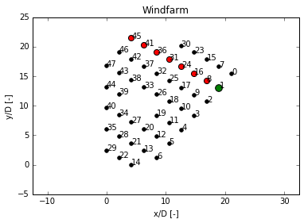
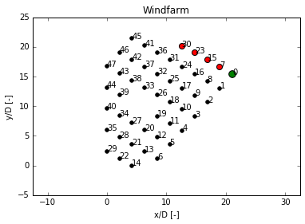
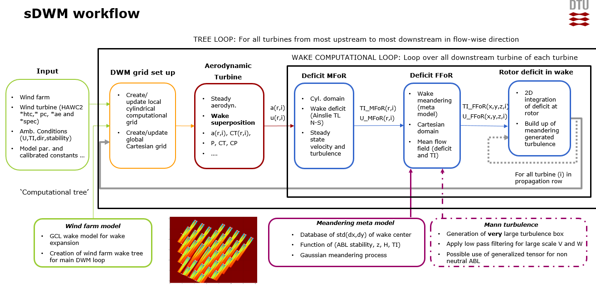
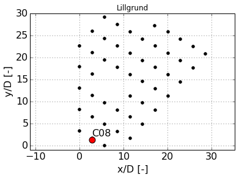
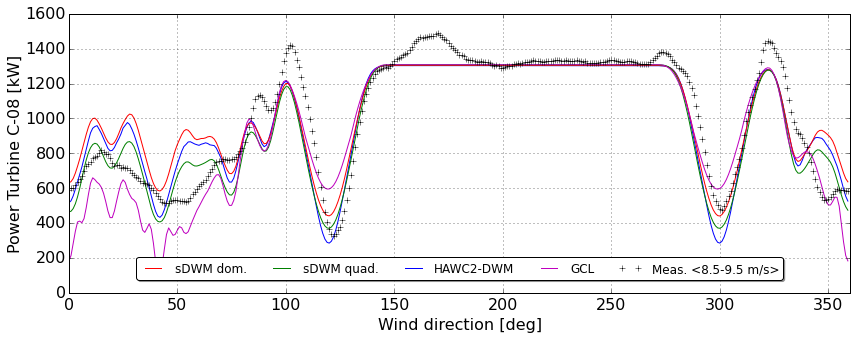

Models
======

Standalone Dynamic Wake Meandering
----------------------------------

The following is a general description of the standalone **Dynamic Wake Meandering (DWM)** implemented in FUSED Wake.
The present software is currently under development (beta version release).
It is an adaptation of the standalone Dynamic Wake Meandering model implementation of Rolf-Erik Keck ([Keck_2013b]_), based on the theory described in [Larsen_2008]_, [Larsen_2015]_, [Madsen_2009]_. 
As opposed to the implementation of the DWM model in the commercial aero-elastic software HAWC2 developed at DTU Wind Energy, the present version of the model is not coupled to an aero-elastic turbine model, and therefore, is only meant to be used in wind farm power production application.

Theory
^^^^^^

Introduction
""""""""""""
The Dynamic Wake Meandering is a widely used engineering model for simulating wind farm wake flows and the structural response of wind turbines in wind farm environment. Its computational demands are typically several order of magnitude lower than Computational Fluid Dynamics model. This model was first proposed by [Madsen_2003]_, with the ambition of combining an engineering flow model that captures the essential physics behind wake dynamics while maintaining low computational demand. This model therefore aims at performing wind farm design calculations, which typically involves a larger number of design iterations, while taking into account both load and power production aspects of each individual turbine. The combined load and power was, prior to the introduction of the DWM mode, not available in widely IEC standards models such as the wake model for load calculation of Frandsen [Frandsen_2007]_ and the industry standard Jensen's model [NOJensen_1983]_ for power production.
The original implementation of the model was proposed by [Madsen_2009]_ in DTU's aero-elastic code HAWC2 [Larsen_2007]_. The present version of the model is an extension of the standalone Matlab based model of 
[Keck_2013b]_ applied to wind farm calculations where each turbine are modeled using a Blade Element Momemtum (BEM) approach.

Wind farm module 
""""""""""""
The wind farm module is initially called prior to any DWM core computations to create the so-called wake tree. The wake tree is a table that describes the wake relationship between turbines for a given wind farm layout and ambient mean flow conditions.
The wake envelop, i.e. the boundaries of the average wake in the fixed frame of reference, is estimated from a single call to the Larsen wake model [Larsen_2009]_, using the mean ambient conditions. Once the average wake expansion is known, the intersection between downstream rotor and the upstream generated wake envelop is investigated to identify downstream rotor in full or partial wake situation. The following illustrates the wake tree of two corresponding rows from the Lillgrund wind farm at an inflow angle of 120deg.

The following shows the corresponding wake tree python dictionary, where turbine index are ranked from the most upstream to the downstream location in the wind farm:
.. code:: 
    {'0': array([ 0,  7, 15, 23, 30]),
     '1': array([ 1,  8, 16, 24, 31, 36, 41, 45]),

Dynamic wake meandering core module
"""""""""""""""""""""""""""""""

The core flowfield calculation are carried out for each turbine from the most upstream to the most downstream location in the wind farm following the preliminary defined wake tree. The calculations are based on the following work flow:

# Computational domain set up.
This step generates a computational grid in Cartesian coordinate system where the width is determined from the lateral position of each downwind turbine with respect to the upstream wake generating one. In order to account for dynamic sideways displacements of the wake, the domain has a larger lateral extent than the downwind rotor lateral positions (typically in the order of 1 rotor diameter). 

# Extracting wake meandering statistics from the meta model.
This step generates time series of wake meandering from the surrogate model developed from high fidelity CFD computations. The meandering magnitude is a function of atmospheric stability [Keck_2013a]_, mean turbulence level and rotor diameter [Larsen_2008]_ as well as turbine hub height. 

# Simulate the steady state aerodynamic response of the turbine
In this step, the aerodynamic module is used to carry out a Blade Element Momemtum (BEM) simulation using as input either free stream conditions or aggregated upstream wakes conditions (through a wake summation model). The resulting rotor averaged velocity deficit and turbulence intensity, power production as well as turbine axial induction are extracted. 

# Compute wake in moving frame of reference (MFOR)
In this step, the axi-symmetric 1D Navier Stokes (NS) folder using the Thin Shear Layer (TL) approximation is used to compute the axi-symmetric wake deficit in the moving frame of reference. This computation is carried out on a cylindrical grid layout extending in the streamwise flow direction to the end of the wake propagation row, i.e., the location of the most downwind turbine. 
The input conditions of the NS-TL solver is based on the radial distribution of axial induction from the aerodynamic module. A complete description of the wake flow model as implemented in the sDWM is available in [Keck_2011]_, [Keck_2012]_, [Keck_2015]_.

# Estimate the wake deficit in the fixed frame of reference (FFOR)
In this step, the resulting deficit in the fixed frame of reference at the downwind location of the waked rotor is calculated. This is done by applying a lateral and longitudinal displacement on the MFOR wake profile within a specified time loop (600 s at 1HZ by default). 

# Estimate the rotor averaged deficit and turbulence level at each downwind rotor.
In this final step, the contribution of the upstream turbines in terms of velocity deficit and added turbulence level to each of its downwind turbine is evaluated and stored for subsequent use in the the aerodynamic module (wake superposition).

The following summarize the standalone Dynamic Wake Meandering work flow in a flow chart.

Current model limitations and future development
^^^^^^
The present implementation aims at simulating the average power production of each turbine in an arbitrary wind farm whereas taking into account the underlying physics behind the classical Dynamic Wake Meandering model. An initial sanity check was performed with the present code implementation where the production of a turbine within the Lillgrund wind farm was compared against the HAWC2-DWM prediction for a mean wind speed of 9 m/s at 6% turbulence intensity and covering the entire wind rose.

DISCLAIMER
^^^^^^
THE SOFTWARE IS PROVIDED "AS IS", WITHOUT WARRANTY OF ANY KIND, EXPRESS
OR IMPLIED, INCLUDING BUT NOT LIMITED TO THE WARRANTIES OF
MERCHANTABILITY, FITNESS FOR A PARTICULAR PURPOSE AND NONINFRINGEMENT. IN
NO EVENT SHALL THE AUTHORS OR COPYRIGHT HOLDERS BE LIABLE FOR ANY CLAIM,
DAMAGES OR OTHER LIABILITY, WHETHER IN AN ACTION OF CONTRACT, TORT OR
OTHERWISE, ARISING FROM, OUT OF OR IN CONNECTION WITH THE SOFTWARE OR THE
USE OR OTHER DEALINGS IN THE SOFTWARE.

fusedwake.sdwm package
======================

Submodules
----------

fusedwake.sdwm.DWM_GClarsenPicks module
---------------------------------------

.. automodule:: fusedwake.sdwm.DWM_GClarsenPicks
    :members:
    :undoc-members:
    :show-inheritance:

fusedwake.sdwm.DWM_calc_mixL module
-----------------------------------

.. automodule:: fusedwake.sdwm.DWM_calc_mixL
    :members:
    :undoc-members:
    :show-inheritance:

fusedwake.sdwm.DWM_flowfield_farm module
----------------------------------------

.. automodule:: fusedwake.sdwm.DWM_flowfield_farm
    :members:
    :undoc-members:
    :show-inheritance:

fusedwake.sdwm.DWM_init_dict module
-----------------------------------

.. automodule:: fusedwake.sdwm.DWM_init_dict
    :members:
    :undoc-members:
    :show-inheritance:

fusedwake.sdwm.DWM_main_BEM module
----------------------------------

.. automodule:: fusedwake.sdwm.DWM_main_BEM
    :members:
    :undoc-members:
    :show-inheritance:

fusedwake.sdwm.DWM_misc module
------------------------------

.. automodule:: fusedwake.sdwm.DWM_misc
    :members:
    :undoc-members:
    :show-inheritance:

fusedwake.sdwm.RUN_sDWM module
------------------------------

.. automodule:: fusedwake.sdwm.RUN_sDWM
    :members:
    :undoc-members:
    :show-inheritance:

fusedwake.sdwm.cBEM module
--------------------------

.. automodule:: fusedwake.sdwm.cBEM
    :members:
    :undoc-members:
    :show-inheritance:

fusedwake.sdwm.cDWM module
--------------------------

.. automodule:: fusedwake.sdwm.cDWM
    :members:
    :undoc-members:
    :show-inheritance:

Module contents
---------------

.. automodule:: fusedwake.sdwm
    :members:
    :undoc-members:
    :show-inheritance:
